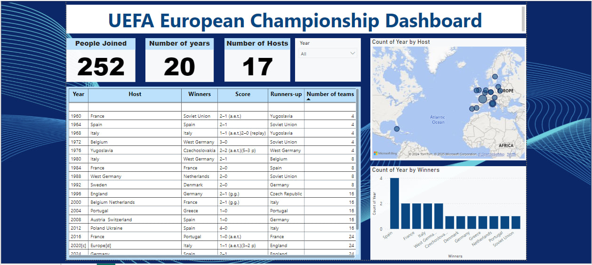

# UEFA European Championship Dashboard  

📊 **Interactive Data Dashboard for the UEFA European Championship**  

This repository contains the Power BI project that visualizes historical data from the UEFA European Championship. The dashboard provides insights into the tournament's history, winners, hosts, and other key statistics.  

---

## 🚀 **Features**  

- **Key Performance Indicators (KPIs):**
  - Total participants: **252**  
  - Number of years: **20**  
  - Number of unique hosts: **17**  

- **Visual Insights:**
  - Bar chart displaying count of wins by country.  
  - Interactive map highlighting hosting nations.  

- **Tabular Data:**
  - Year-wise information including winners, runners-up, scores, and number of teams.

- **Data Cleansing & Transformation:**
  - Utilized Power Query for data extraction, type changes, and column renaming.  

---

## 🛠️ **Technologies Used**  

- **Power BI**: For dashboard creation and visualization.  
- **Power Query**: For data cleaning and transformation.  
- **Data Source**: Historical data of the UEFA European Championship.  

---

## 📂 **Project Structure**  

- `UEFA_European_Championship.pbix`: The Power BI file containing the interactive dashboard.  
- `Data`: Contains website used for building the dashboard.  
- `Dashboard.jpg`: Includes screenshots of the dashboard.  

---

## 📸 **Preview**  

  

---

## 📖 **How to Use**  

1. Clone this repository:  
   ```bash
   git clone https://github.com/Sondos-Mohamed-Said/UEFA-European-Championship-Dashboard.git
   ```  
2. Open the `UEFA_European_Championship.pbix` file in Power BI Desktop.  
3. Explore the dashboard and interact with the visuals.  


## 📧 **Contact**  

If you have any questions or suggestions, feel free to reach out via [LinkedIn](https://www.linkedin.com/in/sondos-mohamed-said/) or create an issue in this repository.  

---  

